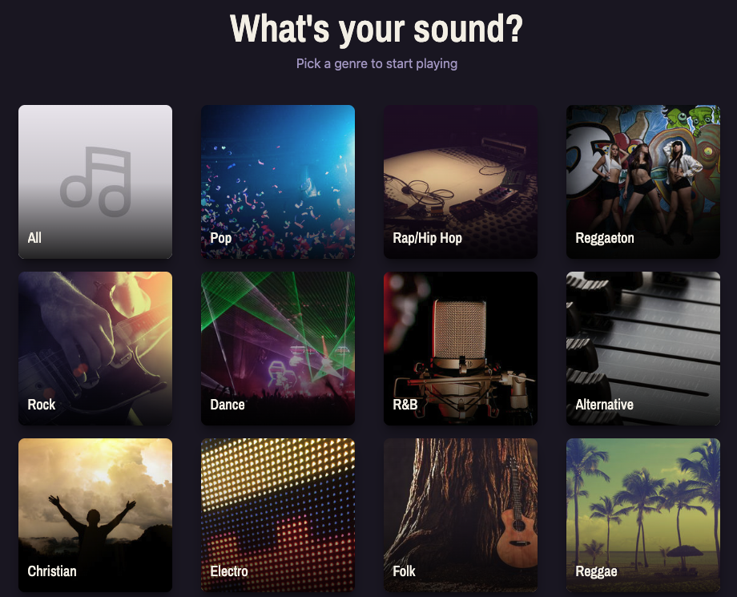

<h1 align="center">🎵 Song Guesser</h1>

<p align="center">
  <strong>Guess the song from a short audio clip.</strong><br />
  Pick a genre, choose your difficulty, and test how well you know the charts!
</p>

<p align="center">
  <a href="https://song-guesser-liard.vercel.app/" target="_blank">
    
  </a>
</p>

<p align="center">
  
</p>

---

## ✨ Features

- **Guess songs** from real Deezer chart previews
- **Adjustable difficulty** - Easy / Medium / Hard
- **Configurable round count** - 5 to 25 rounds
- **Custom-built audio player**
- **Fully responsive design**

## 🛠️ Tech Stack

<p>
  <a href="https://reactjs.org/" target="_blank"></a>
  <a href="https://vitejs.dev/" target="_blank"></a>
  <a href="https://tailwindcss.com/" target="_blank"></a>
  <a href="https://nodejs.org/" target="_blank"></a>
  <a href="https://expressjs.com/" target="_blank"></a>
  <a href="https://vercel.com/" target="_blank"></a>
  <a href="https://render.com/" target="_blank"></a>
  <a href="https://workers.cloudflare.com/" target="_blank"></a>
</p>

| Layer | Tech |
| --- | --- |
| Frontend | React, Vite, Tailwind CSS |
| Backend | Node.js, Express |
| Data | Deezer public API |
| Deployment | Vercel (frontend), Render (backend), Cloudflare Workers (proxy) |


## 🏗️ Architecture

The Express backend proxies all Deezer requests (Deezer's API doesn't support CORS, so direct browser calls aren't possible) and builds quiz rounds server-side - shuffling tracks, generating decoy answers, and applying difficulty-based track pools and playback durations. Genre data is cached in-memory for 24 hours since it changes infrequently.

## 🧩 A real challenge I solved

Deezer's API blocks requests from many cloud-hosting IP ranges at the CDN/WAF level (confirmed via the raw 403 response, which revealed an Akamai edge block).

I resolved this by building a lightweight reverse proxy on **Cloudflare Workers** - since Workers execute from a different edge network than my Render backend, requests routed through it reach Deezer successfully. The Worker enforces a path allowlist so it can't be repurposed as an open proxy to arbitrary Deezer endpoints.

## 📝 Notes

- Backend uptime is maintained via a 5-minute UptimeRobot health check, avoiding Render free-tier cold starts.

## 🚀 Running Locally

**Backend**
```bash
cd backend
npm install
npm start
```

**Frontend:**
```bash
cd frontend
npm install
cp .env.example .env
npm run dev
```

## 📄 License

MIT
